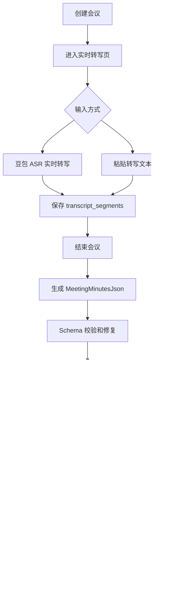

# AI 会议纪要视觉报告生成器 PRD v0.2

版本：v0.2  
状态：开发评审版  
目标读者：产品、设计、前后端开发、AI/ASR/飞书集成开发者  
默认运行形态：本地 Web 单用户应用  

---

## 1. 产品概述

### 1.1 产品名称

**AI 会议纪要视觉报告生成器**

内部工程名建议：

```text
meeting-ai-kit
```

### 1.2 产品定位

本产品是一个面向项目例会、双周会、周会、评审会的会议纪要生产工具。它不是传统会议机器人，也不是单纯录音转文字工具，而是一个将会议内容自动沉淀为结构化纪要、视觉长图和飞书归档文档的工作流工具。

核心链路：

```text
创建会议
  → 实时转写 / 粘贴转写
  → 结构化纪要 JSON
  → HTML/CSS 会议总结长图
  → 编辑确认
  → 飞书 CLI 发布
  → 项目和会议类型归档
```

### 1.3 第一版产品形态

第一版是本地 Web 单用户应用：

```text
Next.js 前端
Fastify 后端
PostgreSQL + Prisma
豆包语音流式 ASR
OpenAI-compatible 纪要模型
React/HTML 总结图模板
Playwright 长图截图
FeishuCliAdapter 封装飞书 CLI
```

第一版默认不做登录权限，所有数据默认归属于本机部署者。

### 1.4 核心价值

| 传统痛点 | 产品价值 |
| --- | --- |
| 会后人工整理纪要耗时 | 会议结束后自动生成结构化纪要 |
| 纪要格式因人而异 | 固定 JSON Schema 和固定长图模板 |
| 风险、行动项难追踪 | 自动抽取风险、阻塞、行动项、负责人、时间 |
| 管理层阅读成本高 | 生成会议总结长图，快速看核心结论 |
| 飞书归档依赖人工 | 一键发布飞书文档并保存链接 |
| ASR 或模型失败影响流程 | 保留粘贴转写兜底入口 |

---

## 2. 用户与场景

### 2.1 目标用户

| 用户角色 | 使用场景 | 核心诉求 |
| --- | --- | --- |
| 项目经理 | 项目周会、双周会、进展同步会 | 快速生成纪要、行动项和风险清单 |
| 交付负责人 | 多系统、多团队进展汇报 | 聚合跨团队阻塞和关键里程碑 |
| 产品经理 | 需求评审、版本评审 | 提炼结论、待办、共识和风险 |
| 管理者 | 查看项目进展和风险 | 快速阅读长图，不陷入转写全文 |
| 会议秘书/运营 | 归档和同步会议结果 | 标准化发布飞书文档 |

### 2.2 第一版重点会议类型

P0 重点支持：

```text
项目双周会
项目周会
版本进展同步会
需求评审会
```

第一版视觉模板锁定：

```text
project_biweekly_v1
```

内容和视觉参考《纪要_青海双周会》：会议背景、顶部视觉总览、核心里程碑、核心风险与阻塞、关键行动、核心共识、全局行动项、AI 洞察、待办、章节时间轴。

---

## 3. 产品目标与范围

### 3.1 P0 范围

P0 必须完成端到端闭环：

| 模块 | P0 要求 |
| --- | --- |
| 会议创建 | 支持创建会议、选择会议类型、项目、参会人、模型、模板、飞书归档位置 |
| 实时 ASR | 接入豆包语音流式 ASR，前端实时展示转写 |
| 粘贴兜底 | 支持粘贴转写文本并生成 transcript segments |
| 转写保存 | 保存 `transcript_segments`，支持后续编辑和纪要生成 |
| 纪要生成 | 使用一个可配置模型生成 `MeetingMinutesJson` |
| Schema 校验 | 使用 Zod 校验 JSON，非法 JSON 自动修复一次 |
| 长图生成 | 使用 HTML/CSS 模板 + Playwright 生成 PNG |
| 确认编辑 | 支持查看原文、编辑纪要 JSON、预览长图 |
| 飞书发布 | 真实调用飞书 CLI 创建文档、上传图片、写入正文 |
| 归档查询 | Dashboard 支持按项目、会议类型、状态筛选 |
| 配置页 | 支持 ASR、模型、模板、飞书配置编辑和测试 |

### 3.2 P1 范围

| 模块 | P1 要求 |
| --- | --- |
| ASR 稳定性 | 更完善的断线重连、本地音频缓存、错误恢复 |
| 飞书索引 | 写入飞书多维表格会议纪要索引 |
| 模板管理 | 支持复制模板、禁用模板、主题色配置 |
| 行动项看板 | 按负责人、状态、截止时间查看行动项 |
| 发布版本 | 支持重复发布时生成新版本或覆盖原文档 |

### 3.3 P2 范围

| 模块 | P2 要求 |
| --- | --- |
| 说话人识别 | 识别并辅助标注说话人 |
| 会议趋势分析 | 跨会议分析项目风险、延期、行动项完成率 |
| 多用户 | 登录、团队、项目权限 |
| 会议工具集成 | 飞书会议、腾讯会议、Zoom 等自动入会或录制集成 |
| 多模板 | 不同会议类型使用差异化长图和飞书正文模板 |

### 3.4 非目标

第一版明确不做：

```text
复杂多租户
会议机器人自动入会
复杂权限系统
多人协同编辑
完全自动说话人识别
图片生成模型生图
外部会议工具深度集成
行动项自动催办
移动端专项适配
```

---

## 4. 核心用户流程

### 4.1 端到端主流程



### 4.2 新建会议流程

用户进入 `/meetings/new`，填写会议基本信息。

字段：

| 字段 | 类型 | 必填 | 默认值/说明 |
| --- | --- | --- | --- |
| 会议主题 | input | 是 | 如“青海项目双周会进展同步” |
| 项目名称 | input/select | 否 | 如“青海项目” |
| 会议类型 | select | 是 | 默认“项目双周会” |
| 参会人 | tag input | 否 | 多人用标签展示 |
| 纪要模型 | select | 是 | 默认当前启用模型 |
| 总结图模板 | select | 是 | 默认 `project_biweekly_v1` |
| 飞书归档位置 | input/select | 否 | 如“青海项目/双周会” |
| 是否启用术语词表 | switch | 否 | 默认开启 |

操作：

| 操作 | 结果 |
| --- | --- |
| 保存草稿 | 创建 `draft` 会议，停留或返回列表 |
| 开始会议 | 创建或更新会议为 `recording`，跳转 `/meetings/:id/live` |

### 4.3 实时转写流程

进入 `/meetings/:id/live` 后，用户可以选择实时 ASR 或粘贴转写。

实时 ASR 流程：

```text
浏览器请求麦克风权限
  → AudioWorklet 将音频转为 16k PCM
  → 按 200ms 切包
  → WebSocket 发送到后端
  → 后端转发到豆包语音 WebSocket
  → 豆包返回识别结果
  → 后端保存 transcript_segments
  → 前端实时展示文本
```

粘贴兜底流程：

```text
用户切换到粘贴转写
  → 粘贴全文
  → 系统按段落或句号切分为 transcript_segments
  → 保存为 provider = "manual_paste"
  → 用户可直接结束会议并生成纪要
```

### 4.4 生成纪要流程

触发条件：

```text
会议状态为 recorded 或 failed 且已有 transcript_segments
```

流程：

```text
用户点击生成纪要
  → 状态变为 generating
  → 后端合并 transcript_segments
  → 调用纪要模型
  → 模型输出 JSON
  → Zod Schema 校验
  → 校验失败则自动 repair 一次
  → 保存 meeting_minutes
  → 状态变为 generated
```

失败处理：

| 异常 | 处理 |
| --- | --- |
| 模型超时 | 自动重试一次 |
| JSON 非法 | 调用 repair prompt 修复一次 |
| repair 失败 | 状态变为 `failed`，保存错误日志 |
| 字段缺失 | owner、due_date 等可补默认值 |
| 无 transcript | 禁止生成，提示先录音或粘贴转写 |

### 4.5 生成长图流程

触发条件：

```text
会议状态为 generated 或 ready_to_publish
```

流程：

```text
读取 MeetingMinutesJson
  → 渲染 /render/meetings/:id/visual
  → Playwright 打开渲染页
  → fullPage screenshot
  → 保存 storage/screenshots/:meetingId.png
  → 保存 visual_reports
  → 状态变为 ready_to_publish
```

### 4.6 Review 确认流程

路径：

```text
/meetings/:id/review
```

布局：

```text
左侧：原始转写
中间：结构化纪要编辑
右侧：总结图预览和发布状态
```

用户可执行：

```text
编辑转写
重新生成纪要
编辑结构化 JSON
重新生成长图
发布飞书
查看飞书链接
```

### 4.7 飞书发布流程

触发条件：

```text
会议状态为 ready_to_publish
存在 meeting_minutes
存在 visual_report.imagePath
飞书 CLI 已登录
```

流程：

```text
状态变为 publishing
  → FeishuCliAdapter.checkAuthStatus
  → createDoc
  → uploadImage
  → appendImage
  → appendHeading / appendParagraph / appendTable
  → 保存 docUrl
  → 写入 feishu_publish_logs
  → 状态变为 published
```

失败处理：

| 异常 | 处理 |
| --- | --- |
| CLI 未登录 | 状态回到 `ready_to_publish`，提示认证 |
| 文档创建失败 | 保留本地纪要和长图，记录失败日志 |
| 图片上传失败 | 不继续正文发布，提示重试 |
| 正文写入失败 | 保存已创建 docUrl 和失败位置 |
| 重复发布 | P0 默认创建新文档，不覆盖旧文档 |

---

## 5. 页面 PRD

### 5.1 `/dashboard` 会议列表

目标：查看历史会议、筛选归档、进入操作页。

筛选项：

| 筛选 | 说明 |
| --- | --- |
| 项目 | 支持输入或选择 |
| 会议类型 | 项目双周会、周会、评审会等 |
| 状态 | draft、recording、published 等 |
| 时间范围 | P0 可选，若成本高可只保留最近会议排序 |

列表字段：

| 字段 | 说明 |
| --- | --- |
| 会议标题 | 点击进入 review 或 live |
| 项目 | `projectName` |
| 会议类型 | `meetingType` |
| 会议时间 | startTime/endTime |
| 状态 | 用标签展示 |
| 风险数量 | 来自 `visual_summary.risk_cards.length` |
| 行动项数量 | 来自 `action_items.length` |
| 飞书链接 | 已发布后展示 |
| 操作 | 继续会议、生成纪要、查看、发布 |

空状态：

```text
暂无会议，展示“新建会议”主按钮。
```

### 5.2 `/meetings/new` 新建会议

目标：创建会议并进入实时转写。

页面分区：

```text
基础信息
参会人与项目
生成配置
飞书归档
```

校验：

| 字段 | 校验 |
| --- | --- |
| 会议主题 | 必填，1-80 字 |
| 会议类型 | 必填 |
| 纪要模型 | 必填且 enabled |
| 总结图模板 | 必填且 enabled |

### 5.3 `/meetings/:id/live` 实时转写页

目标：会议中实时查看文本，并支持粘贴转写兜底。

页面结构：

```text
顶部：会议标题、状态、时长
左侧：实时转写流
右侧：会议信息、ASR 状态、控制按钮
底部：音量、连接、错误提示
```

核心控件：

| 控件 | 行为 |
| --- | --- |
| 开始转写 | 请求麦克风权限并连接后端 WebSocket |
| 暂停 | 停止发送音频，会议仍保持 recording |
| 继续 | 恢复发送音频 |
| 结束会议 | 停止音频，状态变为 recorded |
| 粘贴转写 | 展开 textarea，保存为 manual transcript |
| 编辑段落 | 修改 segment text |

实时段落展示字段：

```text
时间戳
文本
是否最终结果
provider
错误标记
```

### 5.4 `/meetings/:id/review` 纪要确认页

目标：统一完成纪要生成、编辑、长图预览、飞书发布。

三栏布局：

| 区域 | 内容 |
| --- | --- |
| 左栏 | 原始转写段落、搜索、编辑 |
| 中栏 | 结构化纪要表单或 JSON 编辑器 |
| 右栏 | 长图预览、生成按钮、发布按钮、飞书链接 |

P0 编辑方式：

```text
中栏可以先使用 JSON 编辑器 + Schema 校验提示。
后续再升级为分区表单。
```

按钮状态：

| 状态 | 可用操作 |
| --- | --- |
| recorded | 生成纪要 |
| generated | 编辑纪要、生成长图 |
| ready_to_publish | 编辑、重新生成长图、发布飞书 |
| publishing | 禁用编辑，展示进度 |
| published | 展示飞书链接，允许重新发布为新文档 |
| failed | 展示错误，允许重试上一阶段 |

### 5.5 `/render/meetings/:id/visual` 长图渲染页

目标：给 Playwright 截图服务使用。

要求：

```text
宽度固定 1080px
页面背景白色
内容高度自适应
所有中文可换行
表格不横向溢出
适合 fullPage screenshot
不展示普通应用导航栏
```

组件顺序：

```text
Header
MeetingMeta
ExecutiveSummary
MilestoneTimeline
RiskCards
KeyActionGrid
CoreConsensus
ModuleProgressCards
ActionTable
AIInsightBox
TodoList
ChapterTimeline
Footer
```

### 5.6 `/settings` 配置页

第一版可做成一个设置页，分 tab：

```text
豆包 ASR
纪要模型
总结图模板
飞书 CLI
```

#### 豆包 ASR 配置

字段：

```json
{
  "provider": "doubao_streaming_asr",
  "enabled": true,
  "appIdEncrypted": "...",
  "accessTokenEncrypted": "...",
  "cluster": "xxx",
  "sampleRate": 16000,
  "audioFormat": "pcm",
  "chunkMs": 200,
  "replacementWordId": "xxx",
  "enablePunctuation": true
}
```

操作：

```text
保存配置
测试连接
测试替换词 ID
```

#### 纪要模型配置

字段：

```json
{
  "provider": "openai_compatible",
  "baseUrl": "https://your-model-endpoint/v1",
  "apiKeyEncrypted": "...",
  "model": "your-model-name",
  "temperature": 0.1,
  "maxTokens": 12000,
  "jsonMode": true,
  "enabled": true
}
```

操作：

```text
保存配置
测试模型
设为默认
```

#### 总结图模板配置

P0 至少内置：

```json
{
  "id": "project_biweekly_v1",
  "name": "项目双周会长图",
  "type": "html",
  "width": 1080,
  "scale": 2,
  "theme": {
    "primary": "#2563eb",
    "risk": "#e11d48",
    "warning": "#d97706",
    "success": "#16a34a"
  },
  "enabled": true
}
```

#### 飞书 CLI 配置

字段：

```json
{
  "writer": "lark_cli",
  "profile": "default",
  "defaultFolder": "青海项目/双周会",
  "defaultBitable": "会议纪要索引",
  "enabled": true
}
```

操作：

```text
检查登录状态
测试创建文档权限
保存默认归档目录
```

---

## 6. 状态机

### 6.1 状态定义

```ts
type MeetingStatus =
  | "draft"
  | "recording"
  | "recorded"
  | "generating"
  | "generated"
  | "rendering"
  | "ready_to_publish"
  | "publishing"
  | "published"
  | "failed";
```

### 6.2 状态流转

| 当前状态 | 触发 | 下一状态 |
| --- | --- | --- |
| draft | 开始会议 | recording |
| recording | 结束会议 | recorded |
| recorded | 生成纪要 | generating |
| generating | 纪要生成成功 | generated |
| generated | 生成长图 | rendering |
| rendering | 长图生成成功 | ready_to_publish |
| ready_to_publish | 发布飞书 | publishing |
| publishing | 发布成功 | published |
| 任意关键状态 | 失败 | failed |
| failed | 重试上一阶段 | 对应执行中状态 |

### 6.3 前端按钮规则

| 状态 | 主按钮 |
| --- | --- |
| draft | 开始会议 |
| recording | 结束会议 |
| recorded | 生成纪要 |
| generating | 生成中，禁用 |
| generated | 生成长图 |
| rendering | 生成中，禁用 |
| ready_to_publish | 发布飞书 |
| publishing | 发布中，禁用 |
| published | 查看飞书文档 |
| failed | 重试 |

---

## 7. 数据契约

### 7.1 Meeting

```ts
type Meeting = {
  id: string;
  title: string;
  meetingType: string;
  projectName?: string;
  startTime?: string;
  endTime?: string;
  status: MeetingStatus;
  participants: string[];
  summaryModelConfigId: string;
  visualTemplateId: string;
  feishuFolder?: string;
  feishuDocUrl?: string;
  lastError?: string;
  createdAt: string;
  updatedAt: string;
};
```

### 7.2 TranscriptSegment

```ts
type TranscriptSegment = {
  id: string;
  meetingId: string;
  index: number;
  speaker?: string;
  startMs?: number;
  endMs?: number;
  text: string;
  isFinal: boolean;
  provider: "doubao_asr" | "manual_paste";
  rawPayload?: unknown;
  createdAt: string;
  updatedAt?: string;
};
```

### 7.3 MeetingMinutesJson

```ts
type MeetingMinutesJson = {
  meeting_background: {
    title: string;
    topic: string;
    time: string;
    participants: string[];
    project?: string;
    meeting_type: string;
  };

  executive_summary: {
    title: string;
    subtitle: string;
    one_sentence_conclusion: string;
    summary_paragraph: string;
  };

  visual_summary: {
    milestones: Array<{
      date: string;
      title: string;
      bullets: string[];
    }>;
    risk_cards: Array<{
      title: string;
      level: "高" | "中" | "低";
      description: string;
      impact?: string;
      suggestion?: string;
    }>;
    key_actions: Array<{
      title: string;
      owner: string;
      due_date: string;
      status: string;
    }>;
    core_consensus: string;
  };

  module_progress: Array<{
    module_name: string;
    owner?: string;
    current_status: string;
    progress_items: string[];
    blockers?: string[];
    next_steps?: string[];
  }>;

  decisions: Array<{
    decision: string;
    type: "已确认" | "待验证" | "风险提示";
    evidence_text?: string;
    evidence_segment_ids?: string[];
  }>;

  action_items: Array<{
    action: string;
    owner: string;
    due_date: string;
    status: "待推进" | "进行中" | "已完成" | "阻塞" | "待定";
    evidence_text?: string;
    evidence_segment_ids?: string[];
  }>;

  ai_insights: Array<{
    title: string;
    content: string;
    risk_level?: "高" | "中" | "低";
    suggestion?: string;
  }>;

  todos: Array<{
    text: string;
    checked: boolean;
  }>;

  chapters: Array<{
    start_time: string;
    title: string;
    summary: string;
  }>;
};
```

### 7.4 MeetingMinutes

```ts
type MeetingMinutes = {
  id: string;
  meetingId: string;
  rawTranscript: string;
  structuredJson: MeetingMinutesJson;
  markdownContent: string;
  feishuDocBlocks: FeishuDocBlock[];
  modelConfigId: string;
  promptVersion: string;
  createdAt: string;
  updatedAt: string;
};
```

### 7.5 VisualReport

```ts
type VisualReport = {
  id: string;
  meetingId: string;
  templateId: string;
  visualJson: MeetingMinutesJson;
  htmlPath?: string;
  imagePath?: string;
  imageUrl?: string;
  width: number;
  scale: number;
  createdAt: string;
};
```

### 7.6 ActionItem

```ts
type ActionItem = {
  id: string;
  meetingId: string;
  action: string;
  owner: string;
  dueDate: string;
  status: "pending" | "in_progress" | "done" | "blocked" | "unknown";
  evidenceSegmentIds: string[];
  createdAt: string;
  updatedAt?: string;
};
```

### 7.7 ModelConfig

```ts
type ModelConfig = {
  id: string;
  name: string;
  provider: "openai_compatible" | "custom";
  baseUrl: string;
  apiKeyEncrypted: string;
  model: string;
  temperature: number;
  maxTokens: number;
  jsonMode: boolean;
  enabled: boolean;
};
```

### 7.8 MeetingTypeConfig

```ts
type MeetingTypeConfig = {
  id: string;
  name: string;
  key: string;
  defaultSummaryModelConfigId: string;
  defaultVisualTemplateId: string;
  defaultFeishuFolder: string;
  promptTemplateId: string;
  enabled: boolean;
};
```

### 7.9 FeishuPublishLog

```ts
type FeishuPublishLog = {
  id: string;
  meetingId: string;
  docTitle: string;
  docUrl?: string;
  status: "pending" | "success" | "failed";
  errorMessage?: string;
  cliCommandSummary?: string;
  createdAt: string;
};
```

---

## 8. 后端 API

### 8.1 会议 API

```http
POST /api/meetings
GET /api/meetings
GET /api/meetings/:id
PATCH /api/meetings/:id
POST /api/meetings/:id/start
POST /api/meetings/:id/stop
```

`POST /api/meetings` 请求：

```json
{
  "title": "青海项目双周会进展同步",
  "meetingType": "project_biweekly",
  "projectName": "青海项目",
  "participants": ["王利舟", "武小雪"],
  "summaryModelConfigId": "summary_quality_v1",
  "visualTemplateId": "project_biweekly_v1",
  "feishuFolder": "青海项目/双周会"
}
```

### 8.2 转写 API

```http
GET /api/meetings/:id/transcript-segments
POST /api/meetings/:id/transcript-segments
PATCH /api/meetings/:id/transcript-segments/:segmentId
WS /api/meetings/:id/asr
```

WebSocket 客户端发送：

```json
{
  "type": "audio_chunk",
  "meetingId": "meeting_123",
  "sequence": 123,
  "audio": "base64_pcm_chunk"
}
```

WebSocket 服务端返回：

```json
{
  "type": "transcript",
  "segmentId": "seg_123",
  "text": "SMS目前有250项验收偏差点需要对齐",
  "isFinal": true,
  "startMs": 120000,
  "endMs": 125000
}
```

粘贴转写请求：

```http
POST /api/meetings/:id/transcript-segments
```

```json
{
  "provider": "manual_paste",
  "text": "完整会议转写文本..."
}
```

后端按段落或句号拆分，生成连续 `index`。

### 8.3 纪要 API

```http
POST /api/meetings/:id/generate-minutes
GET /api/meetings/:id/minutes
PATCH /api/meetings/:id/minutes
```

生成成功返回：

```json
{
  "minutesId": "minutes_123",
  "status": "generated",
  "structuredJson": {}
}
```

### 8.4 长图 API

```http
POST /api/meetings/:id/render-visual
GET /api/meetings/:id/visual-report
```

返回：

```json
{
  "visualReportId": "visual_123",
  "imagePath": "storage/screenshots/meeting_123.png",
  "imageUrl": "/storage/screenshots/meeting_123.png"
}
```

### 8.5 飞书 API

```http
GET /api/config/feishu/status
POST /api/config/feishu/test
POST /api/meetings/:id/publish-feishu
```

发布成功返回：

```json
{
  "status": "success",
  "docUrl": "https://xxx.feishu.cn/docx/xxx"
}
```

### 8.6 配置 API

```http
GET /api/config/models
POST /api/config/models
PATCH /api/config/models/:id
POST /api/config/models/:id/test

GET /api/config/templates
POST /api/config/templates
PATCH /api/config/templates/:id

GET /api/config/asr
PATCH /api/config/asr
POST /api/config/asr/test

GET /api/config/feishu/status
PATCH /api/config/feishu
POST /api/config/feishu/test
```

---

## 9. 技术产品约束

### 9.1 ASR 约束

第一版固定使用豆包语音流式 ASR。

要求：

```text
音频格式：16k PCM
分包时长：200ms
传输方式：前端到后端 WebSocket，后端到豆包 WebSocket
术语优化：支持 replacementWordId
断线处理：提示用户，允许重连
保存策略：仅保存文字 segment，不默认保存音频
```

ASR 异常处理：

| 异常 | P0 处理 |
| --- | --- |
| 麦克风权限失败 | 前端提示授权，并建议使用粘贴转写 |
| WebSocket 断开 | 展示断线状态，允许手动重连 |
| 豆包返回错误 | 保存 raw error，会议不中断 |
| 替换词 ID 失效 | 使用默认识别继续，不阻塞会议 |

### 9.2 LLM 约束

纪要生成和 AI 洞察由一个模型配置完成。

模型输出要求：

```text
只输出 JSON
必须符合 MeetingMinutesJson Schema
不得编造会议中没有出现的信息
行动项必须包含 owner、due_date、status
缺失负责人填“待定”
缺失时间填“待定”
风险必须进入 visual_summary.risk_cards
行动项必须同时进入 action_items 和 visual_summary.key_actions
AI 洞察必须基于会议内容推导
```

非法 JSON 修复：

```text
第一次生成失败
  → 将原始输出和 Schema 错误传入 repair prompt
  → 修复一次
  → 仍失败则进入 failed
```

### 9.3 长图约束

长图通过 HTML/CSS 生成，不使用文生图模型。

硬性要求：

```text
宽度 1080px
deviceScaleFactor 2
fullPage screenshot
中文稳定显示
表格不溢出
浅色卡片风格
不使用图片模型生成文字
```

默认输出路径：

```text
storage/screenshots/:meetingId.png
```

### 9.4 飞书 CLI 约束

飞书 CLI 必须通过后端适配器调用。

禁止：

```text
禁止模型直接生成 CLI 命令
禁止前端直接传入任意 CLI 命令
禁止执行非白名单命令
禁止把密钥明文写入日志
```

`FeishuCliAdapter` P0 方法：

```ts
class FeishuCliAdapter {
  checkAuthStatus(): Promise<boolean>;
  createDoc(params: { title: string; folder?: string }): Promise<{ docUrl: string; docToken: string }>;
  uploadImage(params: { imagePath: string }): Promise<{ imageToken: string }>;
  appendHeading(params: { docToken: string; text: string; level: 1 | 2 | 3 }): Promise<void>;
  appendParagraph(params: { docToken: string; text: string }): Promise<void>;
  appendImage(params: { docToken: string; imageToken: string }): Promise<void>;
  appendTable(params: { docToken: string; columns: string[]; rows: string[][] }): Promise<void>;
}
```

### 9.5 安全与配置

配置保存要求：

```text
apiKey、accessToken、appId 等敏感字段必须加密保存
日志中不能输出敏感字段
页面展示密钥时默认脱敏
本地单用户不做登录权限
```

---

## 10. 飞书文档输出结构

文档标题：

```text
纪要_{项目名}_{会议类型}_{日期}
```

正文结构：

```text
[会议总结长图]

一、会议背景
主题：
时间：
参与人：
项目：

二、会议总结
一句话结论：
总结正文：

三、模块进展
模块名称
当前状态
进展
阻塞
下一步

四、关键决策与共识
1. xxx
2. xxx

五、全局行动项汇总
表格：行动项 / 负责人 / 截止时间 / 状态 / 依据

六、AI 洞察
- 洞察标题
- 内容
- 建议

七、待办
checkbox 列表

八、章节时间轴
00:00:51 会议开场与议程说明
00:01:28 目录供需联调系统进展汇报
...
```

---

## 11. Prompt 规范

### 11.1 System Prompt

```text
你是一个企业会议纪要结构化助手。

你的任务是根据会议转写文本，生成适合飞书文档和会议总结长图展示的结构化 JSON。

要求：
1. 只输出合法 JSON，不输出 Markdown，不输出解释。
2. 不得编造会议中没有出现的信息。
3. 所有关键结论、风险和行动项应尽量引用原始会议内容作为 evidence_text。
4. 行动项必须包含 action、owner、due_date、status。
5. 如果负责人缺失，填“待定”。
6. 如果时间节点缺失，填“待定”。
7. AI洞察必须基于会议内容推导，不得泛泛而谈。
8. 输出内容要适合直接放入飞书文档和总结长图。
9. 中文表达要简洁、准确、适合管理者快速阅读。
10. 严格按照给定 JSON Schema 输出。
```

### 11.2 User Prompt

```text
会议类型：{{meeting_type}}
会议主题：{{topic}}
项目名称：{{project_name}}
会议开始时间：{{start_time}}
会议结束时间：{{end_time}}
参会人：{{participants}}

以下是会议转写分段，每段包含 segment_id、时间和文本。
请基于这些内容生成结构化会议纪要 JSON。

{{transcript_segments}}
```

### 11.3 Repair Prompt

```text
下面的模型输出不是合法 JSON，或不符合指定 Schema。
请在不新增事实、不改写事实含义的前提下，将其修复为合法 JSON。
只输出修复后的 JSON。

Schema 错误：
{{schema_errors}}

原始输出：
{{raw_output}}
```

---

## 12. 验收标准

### 12.1 端到端验收

P0 完成后必须满足：

```text
1. 用户可以创建一场“项目双周会”。
2. 用户可以进入实时转写页。
3. 用户可以通过豆包 ASR 实时看到转写文字。
4. 用户可以在 ASR 不可用时粘贴转写文本。
5. 系统可以保存 transcript_segments。
6. 用户可以生成合法 MeetingMinutesJson。
7. 纪要包含背景、总结、风险、行动项、AI 洞察、章节。
8. 用户可以生成 1080px 宽会议总结长图。
9. 长图中文正常、表格不溢出、截图清晰。
10. 用户可以在 review 页面编辑和确认。
11. 用户可以真实发布到飞书文档。
12. 飞书文档包含总结图、会议背景、行动项、AI 洞察、章节。
13. 系统保存飞书文档链接。
14. Dashboard 可以按项目、会议类型、状态筛选历史会议。
```

### 12.2 ASR 验收

| 用例 | 预期 |
| --- | --- |
| 首次进入 live 页 | 浏览器请求麦克风权限 |
| 用户允许麦克风 | 成功建立后端 WebSocket |
| 会议中讲话 | 页面持续追加转写段落 |
| 豆包断开 | 页面显示连接异常，允许重连 |
| 替换词 ID 失效 | 继续识别，展示非阻塞提示 |
| 用户结束会议 | 停止音频流，状态变为 recorded |

### 12.3 粘贴兜底验收

| 用例 | 预期 |
| --- | --- |
| 用户粘贴全文 | 系统生成 manual transcript segments |
| 粘贴空文本 | 禁止保存并提示 |
| 粘贴后生成纪要 | 流程与 ASR transcript 一致 |

### 12.4 纪要验收

| 用例 | 预期 |
| --- | --- |
| 模型返回合法 JSON | 保存 meeting_minutes |
| 模型返回 Markdown 包裹 JSON | 自动提取或 repair |
| 缺失 owner | 补“待定” |
| 缺失 due_date | 补“待定” |
| 无风险 | risk_cards 为空数组 |
| 有行动项 | 同时出现在 action_items 和 key_actions |

### 12.5 长图验收

| 用例 | 预期 |
| --- | --- |
| 标准双周会纪要 | 生成完整长图 |
| 中文长文本 | 自动换行 |
| 行动项较多 | 表格不横向溢出 |
| 内容较长 | fullPage 截图完整 |
| 字体缺失 | 使用系统中文字体 fallback |

### 12.6 飞书验收

| 用例 | 预期 |
| --- | --- |
| CLI 已登录 | 可以创建文档 |
| CLI 未登录 | 发布前提示认证 |
| 图片上传成功 | 文档顶部插入总结图 |
| 正文写入成功 | 文档包含完整结构 |
| 发布失败 | 保存失败日志，不丢失本地纪要 |
| 重复发布 | P0 创建新文档并保存最新链接 |

---

## 13. 开发里程碑

### 13.1 Milestone 1：项目骨架与数据契约

交付：

```text
pnpm workspace
apps/web
apps/api
packages/shared
Prisma schema
核心类型和 Zod Schema
```

验收：

```text
web 和 api 可启动
shared types 可被前后端引用
数据库迁移可执行
```

### 13.2 Milestone 2：会议创建、Dashboard、配置页

交付：

```text
/dashboard
/meetings/new
/settings
会议 CRUD
配置 CRUD
```

验收：

```text
可以创建会议
可以查看会议列表
可以保存 ASR、模型、飞书配置
```

### 13.3 Milestone 3：实时 ASR 与粘贴兜底

交付：

```text
/meetings/:id/live
AudioWorklet
后端 ASR WebSocket
DoubaoAsrAdapter
manual transcript 保存
```

验收：

```text
可以实时转写
可以粘贴转写
结束后进入 recorded
```

### 13.4 Milestone 4：纪要生成

交付：

```text
LlmAdapter
project_biweekly prompt
MeetingMinutesJson Zod Schema
repair prompt
meeting_minutes 保存
```

验收：

```text
可以从 transcript 生成合法结构化纪要
非法 JSON 可修复一次
```

### 13.5 Milestone 5：长图模板和截图服务

交付：

```text
packages/visual-renderer
/render/meetings/:id/visual
VisualReportService
Playwright screenshot
```

验收：

```text
可以生成 1080px 宽 PNG
中文和表格显示正常
```

### 13.6 Milestone 6：Review 与飞书发布

交付：

```text
/meetings/:id/review
FeishuCliAdapter
publish-feishu API
feishu_publish_logs
```

验收：

```text
可以确认纪要
可以发布真实飞书文档
系统保存 docUrl
```

---

## 14. 测试计划

### 14.1 单元测试

```text
MeetingMinutesJson Zod Schema
状态机流转
transcript 切分
LLM JSON 提取和 repair
FeishuCliAdapter 命令白名单
```

### 14.2 集成测试

```text
创建会议到 recorded
粘贴转写到生成纪要
生成纪要到渲染长图
ready_to_publish 到 published
飞书发布失败日志记录
```

### 14.3 端到端测试

```text
新建会议
进入 live
粘贴转写文本
生成纪要
生成长图
进入 review
发布飞书
Dashboard 查看归档
```

### 14.4 视觉回归检查

```text
长图截图宽度为 1080px
首屏标题、会议背景、核心风险可见
行动项表格列宽正确
长文本不溢出
章节时间轴完整
```

---

## 15. 开发默认决策

| 决策项 | 默认选择 |
| --- | --- |
| 第一版运行形态 | 本地 Web 单用户 |
| 数据库 | PostgreSQL |
| ORM | Prisma |
| 前端 | Next.js + TypeScript + Tailwind CSS |
| 后端 | Fastify + TypeScript |
| ASR | 豆包语音流式 ASR |
| ASR 音频切包 | 200ms |
| 纪要模型 | OpenAI-compatible |
| 模型配置 | 页面可编辑，密钥加密保存 |
| 长图 | HTML/CSS + Playwright |
| 长图宽度 | 1080px |
| 飞书 | 飞书 CLI + 白名单 Adapter |
| 重复发布 | P0 创建新文档 |
| 登录权限 | P0 不做 |
| 兜底输入 | 粘贴转写文本 |

---

## 16. 待确认外部依赖

这些不影响 PRD 开发，但会影响真实运行：

```text
豆包语音 ASR app_id / token / cluster
豆包 replacement_word_id 词表
OpenAI-compatible 模型 endpoint 和 apiKey
飞书 CLI 安装方式和认证方式
飞书目标目录权限
PostgreSQL 本地连接信息
```

---

## 17. 一句话总结

```text
本产品用豆包语音实时听会，用一个可配置模型生成结构化纪要，用 HTML 模板生成会议总结长图，再通过飞书 CLI 写入并归档为可复盘的项目会议资产。
```
